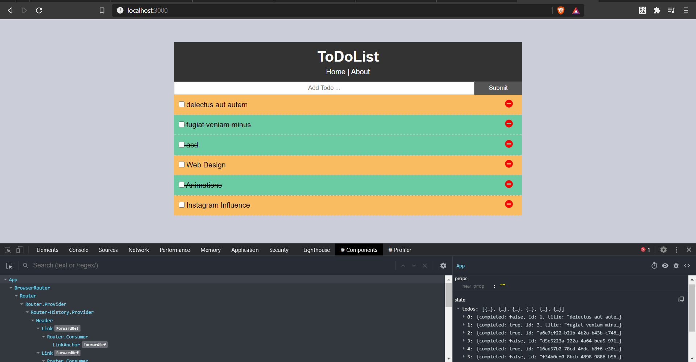
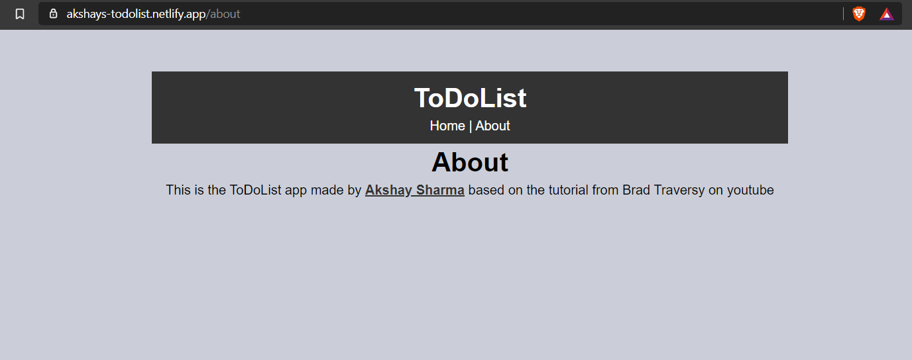

# ToDoList-App

A React App that is made to keep your record of your everyday task.
 

It is a great way to manage & get your work done by listing out the things you will do in a day & marking them as complete as you go along completing the said things.

##### Topics Covered

- Functional & Class Components
- React Fragments
- State Management
- React Hooks
- Browser Router
- LifeCycle Methods
- Axios

## Screenshots

---

### Instructions to Run

##### `clone this repo`

In the project directory, you can run:

##### `npm install`

It installs the dependencies using the package.json file.

##### `npm start`

Start and runs the app which renders in real-time.

##### `npm run build`

Builds the app for production to the `build` folder. 
It correctly bundles React in production mode and optimizes the build for the best performance.

Your app is ready to be deployed! 
Cheers Mate!🍻
